# Technical Deep Dive: RAG Implementation 🧠🔍

This document details the implementation of the Retrieval-Augmented Generation (RAG) pipeline within this repository, designed to process PDF documents and answer queries based on their content.

## High-Level RAG Flow Diagram 📊

```mermaid
graph TD
    A[📄 Input PDFs + Metadata] --> B(Stage 0: GDrive Download & Sanity Check);
    B --> C{☁️ GCS Storage};
    C --> D(Stage 1: PDF Splitting);
    D --> E{📄 Split PDF Chunks};
    E --> F(Stage 1: GCP DocumentAI OCR & Extraction);
    F --> G{📄 .documentai.jsonl Chunks};
    G --> H(Stage 2: Custom Chunking);
    H --> I(code/libdocs/chunker);
    H --> J{🧩 .batchchunker.jsonl Chunks};
    J --> K(Stage 3: Embedding Generation);
    K --> L(code/libdocs/embedder);
    L --> M{🔢 Vector Embeddings};
    M --> N(Stage 3: FAISS Indexing);
    N --> O(code/libdocs/faissindexer);
    O --> P{🗂️ FAISS Vector Index};
    subgraph RAG Core
        Q[❓ User Query] --> R(Query Embedding);
        R --> S(Vector Search);
        P --> S;
        S --> T{"🧩 Retrieved Chunks (Context)"};
        Q --> U(Augmentation);
        T --> U;
        U --> V(LLM Generation);
        V --> W(code/libdocs/classifiers);
        V --> X[✅ Final Answer / Verdict];
    end
    J --> Y(Optional: Store Chunks);
    Y --> Z[💾 GCP BigQuery];
    X --> Z;

    style RAG Core fill:#f9f,stroke:#333,stroke-width:2px
```

## Detailed Implementation Steps 🛠️

The RAG process is interwoven with the main data processing pipeline stages:

**1. Data Ingestion & Initial Processing (Stages 0 & 1)**

*   **Input:** The process begins with PDF documents and their corresponding `.metadata.json` files located in a Google Drive folder.
*   **Retrieval (`code/downloader.py`):** Stage 0 downloads these files, performs MD5 checks, and basic sanity checks (ensuring pairs exist, metadata is parsable via `code/libdocs/metadata/`). Files are stored locally initially.
*   **Splitting (`code/splitter`, part of `code/ingestion.py`):** Before text extraction, PDFs might be pre-processed or split into smaller units if necessary, preparing them for DocumentAI. These split files are uploaded to Google Cloud Storage (GCS).
*   **Text Extraction (GCP DocumentAI):** Stage 1 orchestrates calls to a specified Google Cloud DocumentAI processor.
    *   *Service Used:* Google Cloud DocumentAI (Processor ID specified via `--gcp-dai-processor-id`).
    *   *Input:* PDF files stored in GCS (`--gcs-bucket`, `--gcs-base-dir`).
    *   *Process:* DocumentAI performs OCR, layout analysis, and text extraction.
    *   *Output:* The structured output from DocumentAI, containing text content, layout information, and potentially entities, is saved as `.documentai.jsonl` files back into GCS (`--chunks-dir` pointing to a GCS path). Each line in the JSONL likely represents a page or a significant block identified by DocumentAI.

**2. Advanced Chunking (Stage 2)**

*   **Purpose:** While DocumentAI provides initial chunks, they might not be optimal for semantic retrieval (e.g., spanning unrelated topics, too large/small). Stage 2 refines these.
*   **Implementation (`code/chunker.py`, `code/libdocs/chunker/`):**
    *   *Input:* `.documentai.jsonl` files downloaded from GCS (`--chunks-dir`).
    *   *Process:* Custom logic within `code/libdocs/chunker/` iterates through the DocumentAI output. This logic could implement strategies like:
        *   Fixed-size chunking with overlap.
        *   Sentence-boundary aware chunking.
        *   Paragraph-based chunking.
        *   Semantic chunking (if using models to determine breakpoints).
        *   The goal is to create text segments that contain coherent semantic meaning, suitable for embedding.
    *   *Output:* The refined chunks are saved as `.batchchunker.jsonl` files, typically uploaded back to GCS. These chunks form the basis of the knowledge corpus for RAG.
*   **Storage (GCP BigQuery - Optional but Recommended):** The refined `.batchchunker.jsonl` data is loaded into a BigQuery table (`--gcp-bq-dataset`, `--gcp-bq-table`) for persistent storage, potential metadata joining, and easier querying/analysis outside the direct RAG flow.

**3. Embedding Generation (Stage 3)**

*   **Purpose:** To convert the textual chunks (`.batchchunker.jsonl`) into dense vector representations (embeddings) that capture their semantic meaning.
*   **Implementation (`code/libdocs/embedder/`):**
    *   *Input:* Text content from the `.batchchunker.jsonl` files (likely read from GCS or BigQuery).
    *   *Process:* This module interfaces with embedding models. It might:
        *   Use sentence-transformer models via the Hugging Face library (`code/libdocs/huggingface/`).
        *   Call external embedding APIs (like OpenAI, Cohere, or Google Vertex AI).
        *   The specific model is likely configurable.
    *   *Output:* Numerical vectors (embeddings) for each chunk, often stored temporarily or streamed to the indexing step.

**4. Vector Indexing (Stage 3)**

*   **Purpose:** To store the embeddings in a specialized database that allows for efficient similarity searching.
*   **Implementation (`code/libdocs/faissindexer/`):**
    *   *Input:* The generated vector embeddings.
    *   *Process:* Uses the Faiss library (likely `faiss-cpu` or `faiss-gpu` depending on setup) to build a vector index.
        *   An index type (e.g., `IndexFlatL2`, `IndexIVFPQ`) would be chosen based on trade-offs between search speed, memory usage, and accuracy.
        *   The index is trained (if necessary for the index type) and then populated with the embeddings.
    *   *Output:* A Faiss index file (or set of files). This index needs to be persisted (e.g., saved to GCS or local disk) and loaded into memory for querying.

**5. Retrieval (Stage 3 - Query Time)**

*   **Purpose:** Given a user's query, find the most relevant text chunks from the original documents.
*   **Implementation (Likely within Stage 3 logic or `code/libdocs/classifiers/` coordination):**
    *   *Input:* User query (text).
    *   *Process:*
        1.  **Query Embedding:** The user query is converted into an embedding using the *same* embedding model used in Step 3.
        2.  **Vector Search:** The query embedding is used to search the loaded Faiss index (`code/libdocs/faissindexer/` likely provides search functions). The search returns the IDs and distances/scores of the top-k most similar chunks stored in the index.
        3.  **Chunk Retrieval:** The IDs are used to retrieve the actual text content of the corresponding chunks (from BigQuery, GCS, or an in-memory store).
    *   *Output:* A list of the top-k relevant text chunks (the "context"). Retrieval performance (top-1, top-3 accuracy) is often evaluated here.

**6. Augmentation & Generation (Stage 3 - Query Time)**

*   **Purpose:** To combine the retrieved context with the original query and use an LLM to generate a final, context-aware answer.
*   **Implementation (`code/libdocs/classifiers/`):**
    *   *Input:* Original user query + Retrieved context chunks.
    *   *Process:*
        1.  **Prompt Formatting:** The query and context are formatted into a specific prompt suitable for the chosen LLM. This might involve placing the context before the query, adding instructions, etc.
        2.  **LLM Call:** The formatted prompt is sent to a selected LLM via its respective module (e.g., `code/libdocs/classifiers/acuopenai/`, `anthropic/`, `deberta/`, etc.).
        3.  **Response Parsing:** The LLM's response (the "verdict" or answer) is received and parsed.
        4.  **(Optional) Validation:** The `code/libdocs/llmchecker/` might be used to validate the format or content of the LLM's output.
    *   *Output:* The final generated answer/verdict. This result, along with potentially the query and retrieved context, might be stored back in BigQuery for logging and analysis.

## GCP Services Utilized

*   **Google Cloud Storage (GCS):** Primary storage for intermediate files (split PDFs, DocumentAI JSONL, custom chunks, potentially embeddings and Faiss index).
*   **Google Cloud DocumentAI:** Used for robust OCR and text extraction from PDFs.
*   **Google Cloud BigQuery:** Used for persistent storage of structured chunk data and potentially final results/verdicts. Enables SQL-based analysis.
*   **Google Drive:** Initial source location for input PDFs and metadata.
*   **(Potentially) Google Vertex AI:** Could be used for embedding models or hosting LLMs, though external services/local models are also integrated.

## Conclusion ✅

This RAG implementation provides an end-to-end solution for querying PDF documents. It leverages GCP services for scalable ingestion and storage, incorporates custom chunking for potentially improved retrieval relevance, uses Faiss for efficient vector search, and integrates multiple LLMs for the final generation step. The modular structure (`code/libdocs/`) allows for swapping components like embedding models, indexers, or LLMs. 